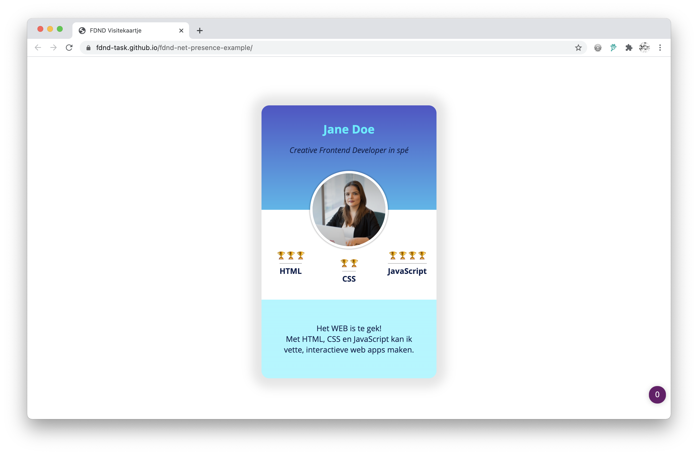

# Visitekaartje
Je bestudeert een uitgewerkt visitekaartje en bekijkt daarbinnen de semantiek in de HTML, de opmaak in CSS en de functionaliteit in Javascript.

## Context

Deze leertaak hoort bij sprint 1 "Your Tribe". Dit is een voorbeeld taak en wordt behandeld tijdens de workshop. Je kunt deze repository gebruiken om de onderwerpen nog eens rustig na te lezen.

## Briefing

Elke frontender bij [FDND](https://fdnd.nl) stelt zichzelf binnen de tribe voor door middel van een visitekaartje. Aan de hand van dit voorbeeld kun je zien wat de werkwijze is voor het ontwerpen en maken van een visitekaartje en hoe de HTML, CSS en JS er uit ziet.

## Doel van deze opdracht

Na het volgen van deze opdracht heb je een beginnend idee van hoe de Development Lifecycle werkt.

## Werkwijze

Dit is een *voorbeeld* taak die wordt behandeld in het bijhorende college. Deze opdracht gaat over alle fases van de **development-lifecycle** [analyseren](#analyseren), [ontwerpen](#ontwerpen), [bouwen](#bouwen), [integreren](#integreren) en [testen](#testen).

Bestudeer aan de hand van het voorbeeld de verschillende fases en de HTML structuur, de CSS vormgeving en de JS interactie. Je kunt [het resultaat alvast in de browser bekijken](https://fdnd-task.github.io/fdnd-visitekaartje-example/) zodat je weet waarmee we aan de slag gaan.

Maak voor jezelf aantekeningen van dingen die je opvallen of dingen die je voor je eigen visitekaartje wilt gebruiken, in de volgende leertaak ga je namelijk je eigen visitekaartje maken.

### Analyseren

In de analysefase inventariseer je wat er moet gebeuren om een taak uit te voeren en formuleer je een aantal uitgangspunten waar je ontwerp aan moet voldoen.

<details>
<summary>Aanpak</summary>

1. Lees de instructies van deze leertaak zorgvuldig door.
2. Bekijk de verschillende fases van de Development Lifecycle en wat je per stap gaat doen.
3. Bespreek wat je aan werk verwacht en maak aantekening. (wat komt je bekend voor, wat heb je al vaker gedaan of wat lijkt je lastig)

</details>

### Ontwerpen

Bij de start van de ontwerpfase weet je wat het doel en het resultaat van je project zijn. In de ontwerpfase neem je ontwerpbeslissingen en zorg je dat je precies weet wat je moet gaan bouwen. 

Nu wordt het tijd om te kijken hoe het resultaat eruit zou kunnen zien. Dit is een belangrijk moment in het project.
(Voor veel opdrachtgevers geldt dat ze nu pas duidelijk krijgen hoe het resultaat eruit zal zien. En dat is een moment waarop veel opdrachtgevers veel duidelijker kunnen aangeven wat ze wel en niet willen.)

<details>
<summary>Aanpak</summary>

1. Schets in je boekje! (Wat wil je over jezelf vertellen? Waar ben je geboren? Waar woon je nu? Wat is je lievelingseten? Heb je een bijbaan? Zit je op een sport? Heb je ambities? Waar wil je goed in worden? Wat zou een leraar van je vorige school over jou vertellen? En wat zeggen je vrienden?)
2. Bespreek je schets en ideeën met je squad en verzamel feedback
3. Schets een een definitieve versie van je visitekaartje
  
  


#### Materiaal ontwerpfase

- Pen en papier.

</details>

### Bouwen

In de bouwfase realiseer je de beslissingen uit de ontwerpfase in HTML, CSS en JS.

Op basis van je ontwerpschets ga je bedenken hoe je je ontwerp in code kan bouwen. Je zet je project op in Github en kopieert de repository naar jouw computer. Je begint met de content in HTML, voegt CSS toe voor de vormgeving en JS voor de interactie. 

De code schrijf je in een _code-editor_ zoals Visual Studio Code. Alle code van je project zet je op Github zodat docenten en studiegenoten kunnen zien wat je hebt gedaan. 


<details>
<summary>Aanpak</summary>

1. HTML is de taal waarmee webpagina's zijn gemaakt die bekeken kunnen worden op het World Wide Web. In het HTML document staat de inhoud van het ontwerp gestructureerd met HTML elementen. In het HTML document van het visitekaartje ```/index.html``` staat alle inhoud die je op de webpagina ziet. 


  
  

  

2. De vormgeving van een webpagina worden vastgelegd in CSS, zoals de layout, achtergrondkleur, tekstkleur en grootte, randen, schaduwen etc). De CSS staat in een los document en wordt aan de HTML pagina gekoppeld in het ```<head>``` element. je mag zelf weten hoe het CSS file heet. In ons voorbeeld heet het file ```/style.css``` en staat het in de map ```/style/```.

  
  

  

  
  
3. De interactie op de pagina wordt bepaald door Javascript (JS). De JS code staat in een los document en moet ook in het HTML document worden gekoppeld. Dat kan in de ```<head>``` maar ook onder aan in het HTML document. je mag zelf weten hoe het JS file heet. In ons voorbeeld heet het file ```/script.js``` en staat het in de map ```/script/```.
  
  

  

  
  

#### Materiaal bouwfase

  Over  HTML, CSS en JavaScript
  - [Getting started with the Web op MDN](https://developer.mozilla.org/en-US/docs/Learn/Getting_started_with_the_web)
  - [HTML: HyperText Markup Language op MDN](https://developer.mozilla.org/en-US/docs/Web/HTML)
  - [CSS: Cascading Style Sheets op MDN](https://developer.mozilla.org/en-US/docs/Web/CSS)
  - [What is JavaScript? op MDN](https://developer.mozilla.org/en-US/docs/Learn/JavaScript/First_steps/What_is_JavaScript)

Workstation
  - [Github](https://github.com)
  - [Github Desktop](https://desktop.github.com)
  - [Visual Studio Code](https://code.visualstudio.com)
  
</details>

### Integreren
In de integratiefase voer je de aanpassingen door zodat iedereen ze kan zien.

Eerst voeg je de nieuwe code toe aan je lokale _repository_ zodat Github weet wat de nieuwste versie is. Daarna ga je de code uploaden naar de online _repository_ op Github. Tot slot ga je je opdracht publiceren met behulp van Github Pages. Als je dat hebt gedaan staat je website online en hebb je een url, nu kunnen anderen je werk ook zien. 

<details>
<summary>Aanpak</summary>

1. Eerst moet je de gewijzigde code toevoegen aan je lokale _repository_ . Schrijf een goede titel en optioneel een beschrijving en klik [Commit to Master]

  


  
2. Daarna kun je de wijzigingen uploaden naar de online _repository_ op Github. Klik op [Push origin]

 


3. Om je website te publiceren moet je in de settings van je online _repository_ op Github de Github-Pages aanzetten. Select bij _Source_ de _master branch_ en  klik [Save]. Na enkele minuten zal je website online te zien zijn op de url. 

  


#### Materiaal integratiefase

- [Wat is GitHub? Hier een heldere uitleg!](https://programmeerplaats.nl/wat-is-github/)
- [Creating a Github pages site @ Github](https://docs.github.com/en/github/working-with-github-pages/creating-a-github-pages-site#creating-your-site)
- [How To Publish Your HTML With Github Pages @ Github](https://anilemrah.medium.com/how-to-publish-your-html-with-github-pages-8f3f854e7d4)

</details>

### Testen

In de testfase controleer je of jouw aanpassingen werken zoals bedoeld.
Dit kan een technische-test zijn, maar ook een test met gebruikers of een presentatie bij de opdrachtgever om te bespreken of de opdracht goed is.


